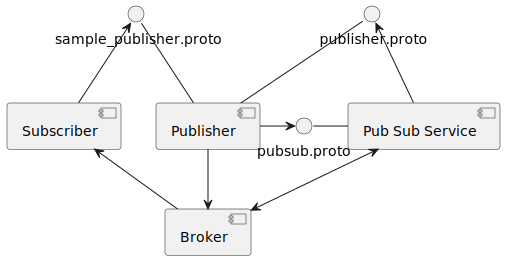
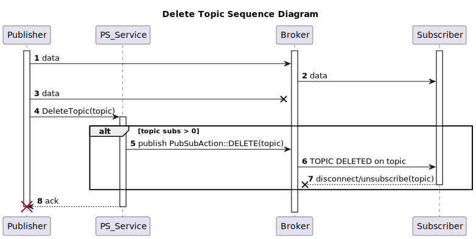
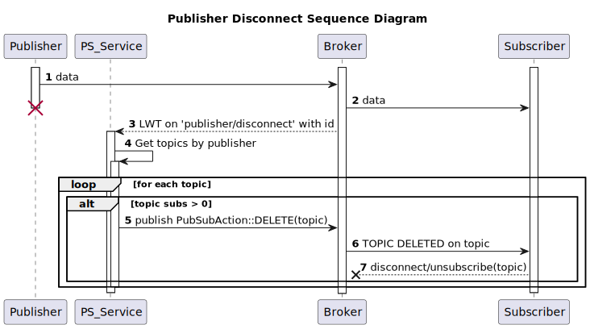
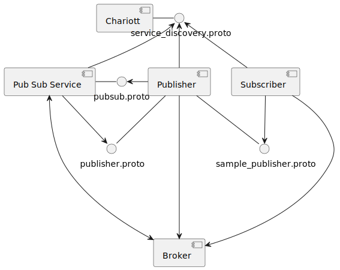

# Design Specification for Pub Sub Service

- [Introduction](#introduction)
  - [Terminology](#terminology)
- [Architecture](#architecture)
  - [Overview](#overview)
  - [Bring Your Own Broker](#bring-your-own-broker)
    - [Why this model?](#why-this-model)
    - [Broker Integration Requirements](#broker-integration-requirements)
- [Sequence Diagrams](#sequence-diagrams)
  - [Subscribe to Topic](#subscribe-to-topic)
  - [Unsubscribe from Topic](#unsubscribe-from-topic)
  - [Delete Topic](#delete-topic)
  - [Publisher Disconnect](#publisher-disconnect)
- [Topic Lifetime](#topic-lifetime)
- [Chariott Integration](#chariott-integration)

## Introduction

The Pub Sub Service provides dynamic publish/subscribe functionality on top of an existing
messaging broker for applications within the vehicle. By registering with
[Eclipse Chariott](https://github.com/eclipse-chariott/chariott), the service can be easily
discovered by other services. The service provides dynamic topic creation and management
capabilities to any service looking to publish data. In addition, it implements a 'Bring Your Own
Broker' model, allowing for any messaging broker meeting certain requirments to be integrated with
the service (see [Bring Your Own Broker](#bring-your-own-broker)).

### Terminology

| Term | Description |
| --- | --- |
| Application | An application is defined as any software component. |
| Broker or Messaging Broker | A messaging broker is a service that provides publish/subscribe functionality and handles the routing of messages from a publisher and a subscriber. |
| Provider or Service Provider | A Provider is an application that registers its capabilities with Chariott's service registry for other applications to consume. |
| Publisher | A publisher is also an application that provides some form of data through publishing to a topic. |
| Subscriber | A subscriber is an application that consumes data by subscribing to a topic. |
> **Note**: "provider", "publisher", or "subscriber" are just roles for an application. Specifically, an application can be any or all of these roles.

## Architecture

### Overview

The Pub Sub Service acts as a common interface ([pubsub.proto](../proto/pubsub/v1/pubsub.proto))
for publishers to use to manage broker and topic information. Publishers interact with the service
through a gRPC interface, allowing them to manage topic lifetimes. When a publisher creates a topic
through this interface, they provide a management endpoint (defined in
[publisher.proto](../proto/publisher/v1/publisher.proto)) so that the Pub Sub Service can provide
relevant information about a topic. In addition, the Pub Sub Service returns the dynamically
generated topic and necessary broker information for a publisher to use to serve their data. A
subscriber will interact with the publisher interface to get the necessary subscription information
(topic name, broker information, etc.) for that data.

Below is a simple component diagram outlining how services interact with the Pub Sub Service.

### Bring Your Own Broker

The Pub Sub Service implements a 'Bring Your Own Broker' model, where any messaging broker that
meets certain requirements can be used.

#### Why this model?

This allows for existing ecosystems that already have a messaging broker to more easily integrate
that broker (and the rest of the ecosystem) with Chariott and services that leverage Chariott.

#### Broker Integration Requirements

To integrate a different broker, a [PubSubConnector](../pub-sub-service/src/pubsub_connector.rs) must
be implemented. This will allow the Pub Sub Service to monitor the broker and enable dynamic topic
management. The service was developed with the [Mosquitto](https://github.com/eclipse/mosquitto)
MQTT messaging broker, and as such there are several capabilities that a broker must meet to be
integrated with minimal changes to the service:

- Broker must provide a way to monitor subscribe requests to a topic.
- Broker must provide a way to monitor unsubscribe requests to a topic.
- Broker must provide a way to monitor clients that disconnect from the broker unexpectedly. This
  is to enable the service to publish a topic deletion message to notify subscribers to drop the
  topic.

If the messaging broker does not meet the above requirements, please reach out to us via a github
issue and we can work together to enable the capabilities with that broker!

In addition, there may be some work to create connectors for publishers and subscribers to
communicate with the messaging broker. See the diagram below for more information.

> **NOTE**: This is the recommended way for publishers and subscribers to implement the connection
            to the messaging broker, requiring only the `PubConnector` and `SubConnector`
            implementations to be re-implemented when intoducing a new broker.

## Sequence Diagrams

Below is a collection of diagrams showing an example interaction of a publisher and subscriber with
the Pub Sub Service.

> **NOTE**: The work of each service to connect/register/discover the relevant services in Chariott
            is ommitted in the below diagrams.

### Subscribe to Topic

Below is a diagram showing the subscription process to a topic:

1. The Subscriber makes a gRPC call to the Publisher to get subscription information on a specified
   subject like 'gps'.
2. Once an info request is received by the Publisher, it dynamically creates a topic via a gRPC
   call to the Pub Sub Service, providing a callback endpoint for dynamic topic management.
3. The Pub Sub Service generates the topic name for the Publisher.
4. The Pub Sub Service returns the newly created topic along with the messaging broker information
   for directly communicating with the broker to publish the data.
5. The Publisher then returns back to the Subscriber the generated topic name and necessary
   information for how to subscribe to the topic data stream (broker endpoint, protocol, etc.).
6. The Subscriber then makes a determination of whether it wants/can subscribe. In this case it
   chooses to, and utilizes the subscription metadata to subscribe to the topic on the broker.
7. The Broker Monitor implemented by the Pub Sub Service receives an event from the broker that a
   subscription event has happened.
8. The Pub Sub Service has a record of this topic, and sends a subscribe event notification to the
   Publisher via the management endpoint provided in step 2.
9. The Publisher, seeing that there is now a subscriber on the topic, starts publishing data.
10. Data now flows to the Subscriber.

### Unsubscribe from Topic

Below is a diagram showing the unsubscribe process from a topic:

1. Data being published to a topic.
2. Data being sent to the Subscriber.
3. Request from the Subscriber to unsubscribe from that topic.
4. Broker stops sending data to the Subscriber.
5. A notification is received from the Broker Monitor that an unsubscribe event happened on a
   topic.
6. The Pub Sub Service determines if there are any subscriptions left on that topic. If so, no
   action is taken. In this case, the number of subscriptions to the topic drops to zero.
7. The Pub Sub Service communicates with the Publisher of the topic data over the management
   callback to inform the Publisher that there is no subscriptions.
8. The Publisher chooses to stop publishing data on the topic.
9. The Pub Sub Service keeps a timeout interval, where it notifies the Publisher that there are
   still no subscriptions to a topic on a loop (assuming no new subscribes have happened).
10. Notification sent to the Publisher management endpoint. The Publisher can choose what to do
    with this information. It can eventually delete the topic, or ignore the notification.

### Delete Topic

Below is a diagram showing the deletion process of a topic:

1. At any time, the Publisher may delete a topic it has created through the Pub Sub Service. This
   is data on a topic being sent to the broker.
2. Same data being sent to the Subscriber.
3. The Publisher stops sending topic data to the broker before deleting the topic.
4. The Publisher calls the Pub Sub Service to delete the topic.
5. The Pub Sub Service then determines if there are any subscribers left on that topic.
6. If so, the Pub Sub Service sends a delete event to the Broker Monitor, which publishes a topic
   deleted message on the topic channel, seen in step 8.
7. The ack returned back to the Publisher. The Publisher is now done with this interaction.
8. The Broker Monitor sends a topic deleted message on the topic channel, which is then forwarded
   by the broker to any subscribers left.
9. The Subscriber then disconnects from the topic, as there will no longer be data published on it.
   The Subscriber may then choose to go back to a service like Chariott to find a new source of the
   data it needs.

### Publisher Disconnect

Below is a diagram shows the process when a publisher dies, or otherwise uncleanly disconnects:

1. This is the data being published to a topic by the Publisher. The Publisher then hits an error
   state and shuts down.
2. Same data being sent to the Subscriber.
3. The broker recognizes that the Publisher has uncleanly disconnected and sends out Last Will and
   Testament (LWT) message, which is received by the Broker Monitor.
4. The Pub Sub Service uses the id passed in the LWT to gather a list of active topics created at
   the request of the Publisher.
5. For each topic, the Pub Sub Service then determines if there are any subscribers left on that
   topic.
6. If so, the Pub Sub Service sends a delete event to the Broker Monitor, which publishes a topic
   deleted message on the topic channel.
7. The Broker Monitor sends a topic deleted message on the topic channel, which is then forwarded
   by the broker to any subscribers left.
8. The Subscriber then disconnects from the topic, as there will no longer be data published on it.
   The Subscriber may then choose to go back to a service like Chariott to find a new source of the
   data it needs. Repeat steps 5-8 for all topics found connected to the Publisher.

## Topic Lifetime

Below is a diagram showing the lifetime of a topic:

- A creation request is made and a new topic is generated. It sits at zero subscriptions.
- When a subscribe event happens, the Publisher is notified that a subscription has occured and the
  topic state is moved to having at least one subscription.
- As long as there is at least one subscription, the topic will stay in this state through multiple
  subscribe and unsubscribe events.
- If the number of subscriptions to a topic reaches zero, then a notification is sent to the
  Publisher of the topic.
- While a topic has zero subs, a timeout loop is initiated, and will notify the Publisher on the
  timeout interval that there are still no subscriptions to a topic.
- At any time, the Publisher may choose to delete a topic, which then sends a notification of
  deletion event to any subscribers to that topic.

## Chariott Integration

The Pub Sub Service connects to [Eclipse Chariott](https://github.com/eclipse-chariott/chariott) as
a Service Provider. This means that the service becomes discoverable through the Chariott service
discovery mechanism. Applications that want to utlize a publish/subscribe service can call Chariott
to return the gRPC endpoint for the Pub Sub Service. Publishers are the only applications that need
to communicate directly with the Pub Sub Service to manage topic lifetimes and get any broker
connection information. Subscribers will get the necessary subscription information from the
publishers themselves.

Below is a diagram showing what interfaces are used to enable Chariott connection:

> **NOTE**: It is expected that publishers register with Chariott and utilize Chariott to find the
            Pub Sub Service via service discovery. This currently requires a publisher to
            implement the provider.proto gRPC interface found in the Chariott repo. This may change
            in the future. Subscribers are expected to get a publisher's endpoint from the
            Chariott discovery service as well.
